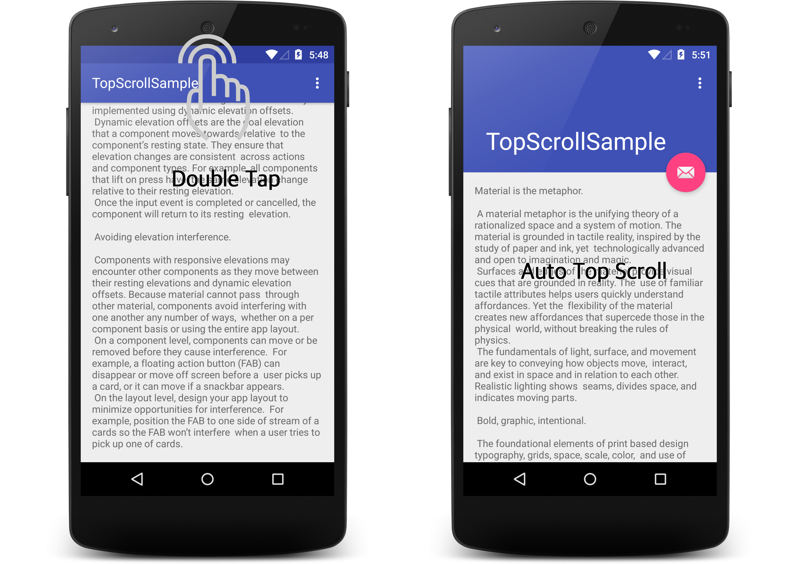

TopScrollHelper

안드로이드의 스크롤의 기능을 가진 View에서 최상단으로 돌아가기 위한 사용자들을 편의제공을 위해 작성된 코드이다. 안드로이드 상단 시스템바에 더블탭을 하면 스크롤의 기능을 가진 View들은 최상단으로 스크롤 하게 된다. 아이폰의 시스템바의 시계를 더블터치하면 최상단으로 스크롤 되는 기능과 동일하다.

안드로이드 개발자들은 간단한 코드를 통해 이와 같은 기능을 사용할 수 있다. 
 
 



  
  

자동스크롤 지원 View
-----------

* ScrollView
* NestedScrollView
* WebView
* ListView
* RecyclerView


  
  

사용법
-----------

* 안드로이드 Manifest에 다음과 윈도우 팝업을 사용할 수 있도록 퍼미션을 추가 한다.

```
<uses-permission android:name="android.permission.SYSTEM_ALERT_WINDOW"/>
```

  
  

* 자동 스크롤 기능을 추가 하기위해 스크롤 되는 뷰를 addTargetScrollView(view)메소드로 추가하고 removeTargetScrollView(view)로 제거한다.
Activity또는 Fragment의 스크롤뷰가 Create와 Destory되는 LifeCycle 시점에 맞게 호출 해준다.


```
@Override
protected void onCreate(Bundle savedInstanceState) {
 …

 mNestedScrollView = (NestedScrollView) findViewById(R.id.scrollView);
 TopScrollHelper.getInstance(getApplicationContext()).addTargetScrollView(mNestedScrollView);
}

 

@Override
protected void onDestroy() {
 …

 TopScrollHelper.getInstance(getApplicationContext()).removeTargetScrollView(mNestedScrollView);
 super.onDestroy();
}

```

* 안드로이드 6.0(마시멜로)부터는 직접 퍼미션을 얻어야 하며, 퍼미션을 얻은 후 addTargetScrollView(view)를 호출한다.
  
  
  

영상
-----------
https://youtu.be/dlZoVnZoIVk


